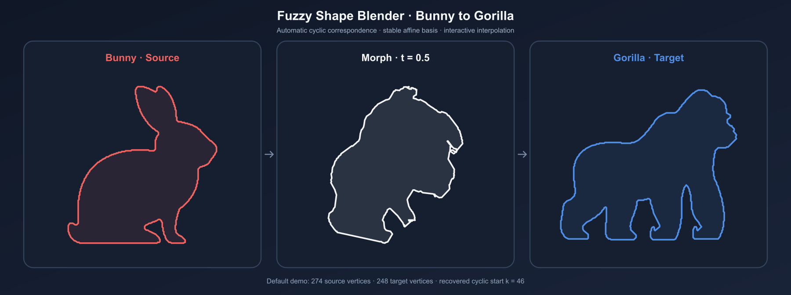

# Fuzzy Shape Blender

[简体中文](README.zh-CN.md) | **English**

An interactive 2D polygon morphing demo implemented in C++17. The project builds ordered vertex correspondence with fuzzy local-shape similarity and dynamic programming, then generates intermediate contours in a stable affine coordinate system.



## Highlights

- **Automatic cyclic correspondence** — compares local edge ratios and angles, preserves contour order, and searches every possible start vertex in `O(m²n)` time.
- **Stable affine basis** — jointly selects three corresponding vertex pairs with both high local similarity and sufficient triangle coverage, avoiding near-collinear bases.
- **Structure-aware interpolation** — interpolates the affine transform and each vertex's local coordinates instead of directly blending world-space positions.
- **Interactive inspection** — adjusts interpolation time and similarity weights through Dear ImGui.
- **Automatic viewport fitting** — source, intermediate, and target contours are centered and scaled independently, so the default example is visible immediately.

The bundled example morphs a 274-vertex bunny contour into a 248-vertex gorilla contour. The current automatic search recovers cyclic start vertex `k = 46`.

## Algorithm overview

1. Extract an ordered polygon from each silhouette.
2. Describe every vertex by the two adjacent edge lengths and its local angle.
3. Convert descriptor differences into a fuzzy similarity score in `[0, 1]`.
4. Run order-preserving dynamic programming on the resulting cost matrix.
5. Repeat the DP search for every cyclic start vertex of the source contour.
6. Select a well-spread affine basis from high-quality correspondence pairs.
7. Interpolate the affine transform and per-vertex local coordinates.

The implementation assumes that polygon A has at least as many vertices as polygon B. The included contours satisfy that requirement.

## Build and run

The current repository is verified on macOS with Apple Clang, CMake, and OpenGL 3.3.

```bash
git clone --recurse-submodules https://github.com/Isawarty/ShapeBlenderProject.git
cd ShapeBlenderProject
cmake -S . -B build -DCMAKE_BUILD_TYPE=Release
cmake --build build -j
cd build
./ShapeBlender
```

Run the executable from the `build/` directory because the default asset paths are relative to that directory.

## Controls

- **Time (t)**: inspect the morph from source (`0`) to target (`1`).
- **Auto-Find Best k**: search the cyclic start vertex automatically.
- **Manual k**: inspect a specific start vertex when automatic search is disabled.
- **sim_t weights**: balance local edge-ratio similarity and angle similarity.
- **smooth_a weights**: balance shape, rotation, and area terms used by basis selection.
- **Recompute** buttons: apply updated parameters without restarting the program.

## Generate contours from other images

The optional preprocessing tool uses Python, OpenCV, and NumPy:

```bash
python3 -m venv .venv
source .venv/bin/activate
pip install -r scripts/requirements.txt
cd scripts
python extract_contours.py
```

It writes `assets/poly_a.json` and `assets/poly_b.json`. Load those paths from the control panel. Polygon A must contain at least as many vertices as polygon B.

## Repository layout

```text
ShapeBlenderProject/
├── assets/
│   ├── image_*.png              # Example silhouette images
│   ├── bunny_contour.json       # Default source contour
│   └── gorilla_contour.json     # Default target contour
├── docs/
│   └── demo-bunny-gorilla.png   # README demonstration image
├── include/
│   ├── Application.h            # Window, UI, and viewport declarations
│   ├── Polygon.h                # Polygon data and local descriptors
│   └── ShapeBlender.h           # Correspondence and interpolation API
├── lib/
│   ├── eigen/                   # Linear algebra
│   ├── glfw/                    # Window and OpenGL context
│   ├── imgui/                   # Interactive user interface
│   └── json/                    # JSON parsing
├── scripts/
│   ├── extract_contours.py      # Optional image-to-contour preprocessing
│   └── requirements.txt         # OpenCV and NumPy dependencies
├── src/
│   ├── Application.cpp          # ImGui controls and fitted viewport rendering
│   ├── Polygon.cpp              # Contour loading and descriptor computation
│   ├── ShapeBlender.cpp         # DP correspondence and affine interpolation
│   └── main.cpp                 # Program entry point
├── CMakeLists.txt               # CMake build definition
├── README.md                    # English documentation
└── README.zh-CN.md              # Simplified Chinese documentation
```

## Implementation notes

- The fuzzy score is a continuous similarity measure; it is unrelated to image blur.
- The DP path only moves south or southeast, preserving contour order while allowing multiple source vertices to map to one target vertex when `m > n`.
- The automatic start search stores the winning offset in `m_bestK`; backtracking restores correspondence indices using that same offset.
- Basis selection rejects triples whose normalized triangle coverage is below `0.02`, reducing numerical instability during interpolation.

## Acknowledgements

This course project follows a fuzzy-mathematics approach to 2D polygon morphing attributed in the course material to Zhang (1996). Eigen, GLFW, Dear ImGui, nlohmann/json, OpenCV, and NumPy provide the supporting math, UI, file, and preprocessing functionality.
